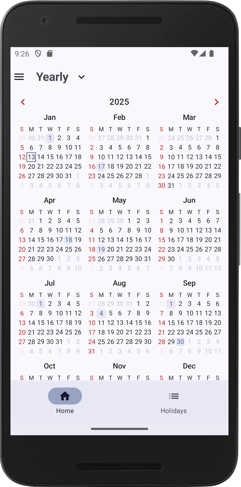
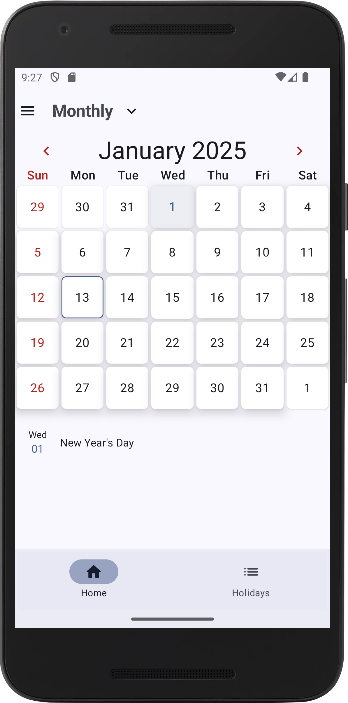
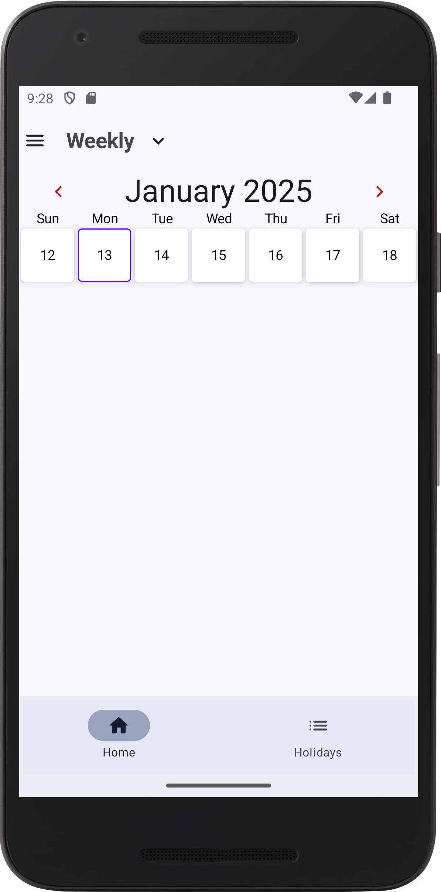
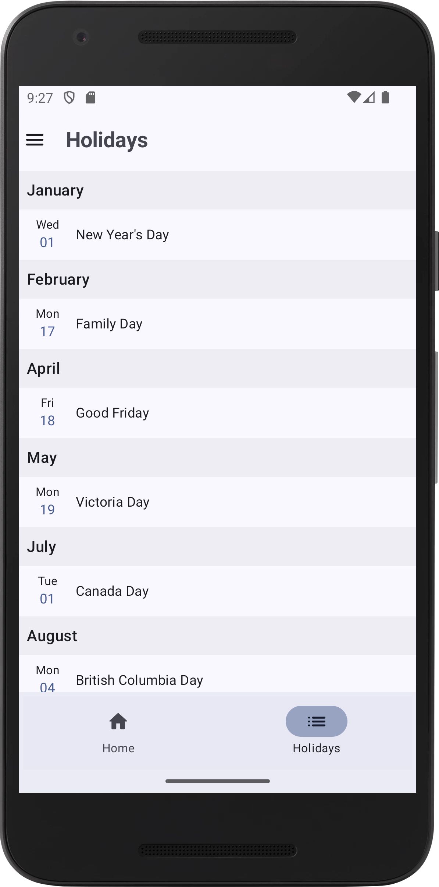
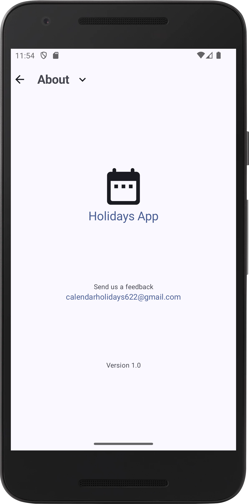
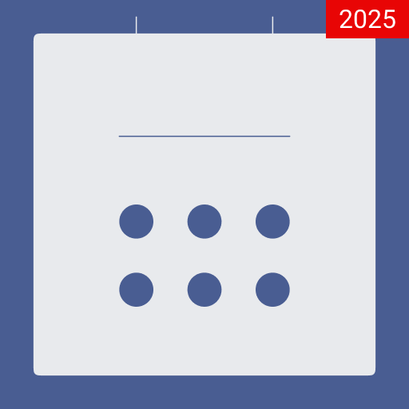

## Compose-Holidays — A Jetpack Compose Public Holidays Viewer

Compose-Holidays is a modern Android app built with Jetpack Compose that helps you quickly browse public holidays. It presents clean Yearly, Monthly, and Weekly calendar views, plus a grouped list of holidays. The app fetches data from the open Nager.Date API, caches results for snappy navigation, and lets you choose your country.

## Table of Contents

- [Features](#features)
- [Screenshots](#screenshots)
- [Technical Architecture](#technical-architecture)
- [Offline-First Design](#offline-first-design)
- [Key Technologies & Libraries](#key-technologies--libraries)
- [API Interaction](#api-interaction)
- [Requirements](#requirements)
- [Setup & Installation](#setup--installation)
- [Future Enhancements](#future-enhancements)
- [Design & Mockups](#design--mockups)

## Features

- **Multiple calendar views**: Yearly, Monthly, and Weekly views powered by a Compose calendar.
- **Holidays list**: Consolidated view grouped by month for the selected year.
- **Country selection**: Pick your country in `Settings`; the country list is cached locally.
- **Smart caching**: In-memory caching of holidays across adjacent years for fast paging; avoids duplicate network calls.
- **Simple navigation**: Drawer for `Settings` and `About`, plus bottom tabs for Home and Holidays.
- **Material 3 theming**: Polished UI with light/dark theme support.
- **No sign-in required**: Uses the public Nager.Date API.

## Screenshots

> Images are included under `screenshots/`.

- **Feature graphic**

  

- **Yearly view (Home)**

  

- **Monthly view**

  

- **Weekly view**

  

- **Holidays list**

  

- **About**

  

- **App icon**

  

## Technical Architecture

The project follows a pragmatic, feature-oriented structure with a layered approach reminiscent of MVVM. Core parts:

- **Presentation (Compose + ViewModel)**
  - `CalendarScreenViewModel` exposes `state` and holiday flows, reacts to `CalendarScreenAction` (year/month/week/country changes), and emits transient UI events.
  - Screens: `YearScreen`, `MonthScreen`, `WeeklyCalendarScreen`, `HolidaysScreen`, `SettingsScreen`, `AboutScreen`.
  - Navigation uses a parent + nested `NavHost` setup managed by `ScreensNavigator`.

- **Domain**
  - Models: `Holiday`, `Country`, `State`.
  - Use cases: `FetchHolidaysUseCase`, `FetchListOfCountriesUseCase`, `GetCurrentLocationUseCase`.
  - Contracts: lightweight interfaces like `HolidayCache`, `HolidayLocalDataSource`, `CountryLocalDataSource`.

- **Data**
  - Remote: `HolidaysApi` (Retrofit) calls Nager.Date endpoints.
  - Local: Room database `HolidaysDatabase` with `HolidayDao` and `CountryDao` plus `RoomHolidayLocalDataSource` and `RoomCountryLocalDataSource`.
  - In-memory: `DefaultHolidayCache` stores the most recently fetched holidays for quick navigation.
  - DI: `DataModule` and `AppModule` wire up Retrofit, Room, repositories/data sources, and dispatchers via Hilt.

This separation keeps UI concerns out of data-fetching and enables straightforward testing and future evolution.

## Offline-First Design

Compose-Holidays implements light offline support focused on responsiveness:

- **Country list persistence**: Countries are stored in Room so the picker works without network after the first run.
- **Holiday caching**: An in-memory `HolidayCache` stores holidays for the current and adjacent years to minimize repeated requests when paging the calendar.
- **Note**: Full offline syncing is not the goal of this app (no background workers or conflict resolution). It prioritizes fast browsing of public holiday data.

## Key Technologies & Libraries

- **Language**: Kotlin
- **UI Toolkit**: Jetpack Compose + Material 3
- **Navigation**: Jetpack Navigation Compose
- **DI**: Hilt (Dagger)
- **Networking**: Retrofit with Gson converter and OkHttp logging interceptor
- **Local Database**: Room (entities for Holidays and Countries)
- **Async**: Kotlin Coroutines and Flow
- **Calendar UI**: `io.github.boguszpawlowski:composecalendar`

## API Interaction

- **Base URL**: `https://date.nager.at`
- **Endpoints**:
  - `GET /api/v3/PublicHolidays/{Year}/{CountryCode}` — list of public holidays.
  - `GET /api/v3/AvailableCountries` — country catalog used by the Settings screen.
- **Auth**: None required (public API).

## Requirements

- **Android**: minSdk 26, targetSdk 35 (as configured)
- **Tooling**: Android Studio (latest stable recommended)
- **Permissions**: The app may request location permission to infer a default country/state.

## Setup & Installation

1. **Clone the repository**

   ```bash
   git clone https://github.com/andresfelipear/Compose-HolidaysApp.git
   cd Compose-HolidaysApp
   ```

2. **Open in Android Studio** and let Gradle sync.

3. **Run the app** on a device or emulator. No API keys are needed.

## Future Enhancements

- Persist holidays in Room and serve from local when offline.
- Province/state selection and per-region holiday filtering.
- Search and quick-jump in the holidays list.
- App widget with upcoming holidays.
- CI, tests, and accessibility polish.

## Design & Mockups

The UI is built directly with Jetpack Compose and Material 3 components. Visual assets include a feature graphic and app icon in `screenshots/`.
